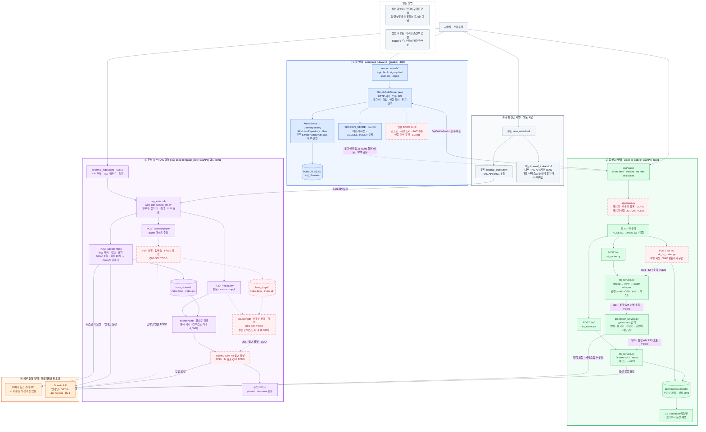

# 프로젝트 구조 — 통합 아키텍처

세 프로젝트의 `프로젝트 구조.md`와 현재 소스의 주요 연결을 하나의 Mermaid 다이어그램으로 통합했습니다. 인증, 음성 AI, RAG, 외부 연동, 공통 진입 화면을 색상과 영역 테두리로 구분했습니다.

## 통합 다이어그램

```mermaid
%%{init: {"theme":"base","themeVariables":{"fontFamily":"Pretendard, Noto Sans KR, sans-serif","fontSize":"15px","lineColor":"#64748b","primaryTextColor":"#0f172a"},"flowchart":{"curve":"basis","nodeSpacing":25,"rankSpacing":45,"htmlLabels":true}}}%%
flowchart TB
    USER["사용자 · 브라우저"]
    subgraph AUTH["① 인증 영역 | workplace | Java 17 · Gradle | :8080"]
        direction TB
        AUI["resources/web/<br/>login.html · signup.html<br/>style.css · app.js"]
        ASERVER["SimpleAuthServer.java<br/>HTTP 서버 · 인증 API<br/>로그인 · 가입 · 인증 확인 · 로그아웃"]
        ASERVICE["AuthService → UserRepository<br/>JdbcUserRepository · User<br/>모두 SimpleAuthServer.java 내부 선언"]
        ADB[("MariaDB :53301<br/>sql_db.users")]
        ATOKEN["SESSION_STORE · JwtUtil<br/>메모리 세션 · ACCESS_TOKEN 쿠키"]
        ATODO["인증 TODO ①~⑤<br/>로그인 · 세션 조회 · JWT 검증<br/>인증 거부 조건 · BCrypt"]
        AUI --> ASERVER --> ASERVICE --> ADB; ASERVER --> ATOKEN
        ASERVER -.- ATODO
    end
    subgraph VOICE["② 음성 AI 영역 | voice-ai_code | FastAPI | :8008"]
        direction TB
        VUI["app/static/<br/>index.html · stt.html · tts.html<br/>stt-tts.html"]
        VMAIN["app/main.py<br/>페이지 · 라우터 등록 · CORS<br/>페이지 인증 Q01·Q02 TODO"]
        VJWT["각 API 라우터<br/>ACCESS_TOKEN JWT 검증"]
        VSTT["POST /stt/<br/>stt_router.py"]
        VTTS["POST /tts/<br/>tts_router.py"]
        VPIPE["POST /stt-tts/<br/>stt_tts_router.py<br/>파일 저장 · WAV 변환까지 구현"]
        VRECOG["stt_service.py<br/>ffmpeg → WAV → faster-whisper<br/>로컬 small · CPU · int8 → 텍스트"]
        VTRANS["processor_service.py<br/>gpt-4o-mini 번역<br/>영어 · 중국어 · 한국어 · 일본어 · 베트남어"]
        VSPEECH["tts_service.py<br/>OpenAI tts-1 · nova<br/>텍스트 → MP3"]
        VFILES[("app/routers/uploads/<br/>오디오 파일 · 생성 MP3")]
        VPLAY["GET /uploads/파일명<br/>브라우저 음성 재생"]
        VUI --> VMAIN --> VJWT; VJWT --> VSTT & VTTS & VPIPE
        VSTT --> VRECOG; VTTS --> VSPEECH
        VPIPE -.->|"Q03 · STT 호출 TODO"| VRECOG; VRECOG -.->|"Q04 · 통합 API 번역 호출 TODO"| VTRANS
        VTRANS -.->|"Q05 · 통합 API TTS 호출 TODO"| VSPEECH; VPIPE --> VFILES
        VSPEECH --> VFILES --> VPLAY
    end
    subgraph RAG["③ 문서·뉴스 RAG 영역 | rag-code-template_ext | FastAPI | 예시 :8001"]
        direction TB
        RUI["external_index.html · Vue 3<br/>뉴스 주제 · PDF 업로드 · 질문"]
        RAPI["rag_external-web_pdf_closed_llm.py<br/>라우터 · 전처리 · 검색 · LLM 호출"]
        RTOPIC["POST /upload-topic<br/>뉴스 제목 · 링크 · 요약<br/>500자 분할 · 중첩 80자 → OpenAI 임베딩"]
        RPAPER["POST /upload-paper<br/>pypdf 텍스트 추출"]
        RPDFBUILD["PDF 분할 · 임베딩 · FAISS 생성<br/>Q01·Q02 TODO"]
        RWEBDB[("faiss_db/web/<br/>index.faiss · index.pkl")]
        RPDFDB[("faiss_db/pdf/<br/>index.faiss · index.pkl")]
        RQUERY["POST /rag-query<br/>질문 · source · top_k"]
        RWEBSEARCH["source=web · 유사도 검색<br/>중복 제거 · 컨텍스트 최대 4,000자"]
        RPDFSEARCH["source=pdf · 저장소 선택 · 검색<br/>Q03·Q04 TODO<br/>본문 컨텍스트 최대 12,000자"]
        RANSWER["OpenAI GPT-4o 답변 생성<br/>PDF LLM 호출 Q05 TODO"]
        RRESULT["응답 후처리<br/>prompt · response 반환"]
        RUI --> RAPI; RAPI --> RTOPIC & RPAPER & RQUERY
        RTOPIC --> RWEBDB; RPAPER -.-> RPDFBUILD -.-> RPDFDB
        RQUERY --> RWEBSEARCH; RWEBDB --> RWEBSEARCH --> RANSWER
        RQUERY -.-> RPDFSEARCH; RPDFDB -.-> RPDFSEARCH -.->|"Q05 · 답변 요청 TODO"| RANSWER
        RANSWER --> RRESULT
    end
    subgraph SHARED["④ 외부 연동 영역 | 프로젝트별로 호출"]
        direction LR
        NAVER["네이버 뉴스 검색 API<br/>기사 본문 직접 수집 없음"]
        OPENAI["OpenAI API<br/>임베딩 · GPT-4o<br/>gpt-4o-mini · tts-1"]
    end
    subgraph ENTRY["⑤ 공통 진입 화면 · 별도 화면"]
        direction LR
        INTRO["루트 intro_main.html"]
        EXTERNAL["루트 external_index.html<br/>RAG API :8001 호출"]
        INTERNAL["루트 internal_index.html<br/>내부 RAG API 기본 :8002<br/>대응 서버 소스는 현재 폴더에서 미확인"]
        INTRO --> EXTERNAL & INTERNAL
    end
    USER --> AUI; USER --> VUI
    USER --> INTRO; USER --> RUI
    VUI -->|"/api/auth/check · 인증 확인"| ASERVER
    ATOKEN -.->|"로그인 완성 시 :8008 화면 이동 · JWT 공유"| VUI
    RTOPIC -->|"뉴스 검색 요청"| NAVER
    RTOPIC -->|"임베딩 요청"| OPENAI
    RPDFBUILD -.->|"임베딩 연결 TODO"| OPENAI
    RANSWER -->|"답변 요청"| OPENAI
    VTRANS -->|"번역 요청 · 서비스 함수 구현"| OPENAI
    VSPEECH -->|"음성 합성 요청"| OPENAI
    EXTERNAL -->|"RAG API 요청"| RAPI
    subgraph LEGEND["읽는 방법"]
        direction LR
        L1["실선 화살표: 코드에 구현된 연결<br/>실행 성공을 보장하는 표시는 아님"]
        L2["점선 화살표: 미구현·조건부 연결<br/>TODO 노드: 보완이 필요한 부분"]
    end
    classDef auth fill:#dbeafe,stroke:#2563eb,color:#172554
    classDef voice fill:#dcfce7,stroke:#16a34a,color:#14532d
    classDef rag fill:#f3e8ff,stroke:#9333ea,color:#581c87
    classDef ext fill:#ffedd5,stroke:#ea580c,color:#7c2d12
    classDef todo fill:#fff1f2,stroke:#e11d48,color:#9f1239,stroke-dasharray:5 4
    classDef neutral fill:#f1f5f9,stroke:#64748b,color:#0f172a
    class AUI,ASERVER,ASERVICE,ADB,ATOKEN auth
    class VUI,VJWT,VSTT,VTTS,VRECOG,VTRANS,VSPEECH,VFILES,VPLAY voice
    class RUI,RAPI,RTOPIC,RPAPER,RWEBDB,RQUERY,RWEBSEARCH,RRESULT rag
    class NAVER,OPENAI ext
    class ATODO,VMAIN,VPIPE,RPDFBUILD,RPDFDB,RPDFSEARCH,RANSWER todo
    class USER,INTRO,EXTERNAL,INTERNAL,L1,L2 neutral
    style AUTH fill:#eff6ff,stroke:#2563eb,stroke-width:2px
    style VOICE fill:#f0fdf4,stroke:#16a34a,stroke-width:2px
    style RAG fill:#faf5ff,stroke:#9333ea,stroke-width:2px
    style SHARED fill:#fff7ed,stroke:#ea580c,stroke-width:2px
    style ENTRY fill:#f8fafc,stroke:#64748b,stroke-width:2px
    style LEGEND fill:#ffffff,stroke:#94a3b8,stroke-dasharray:5 4
```
